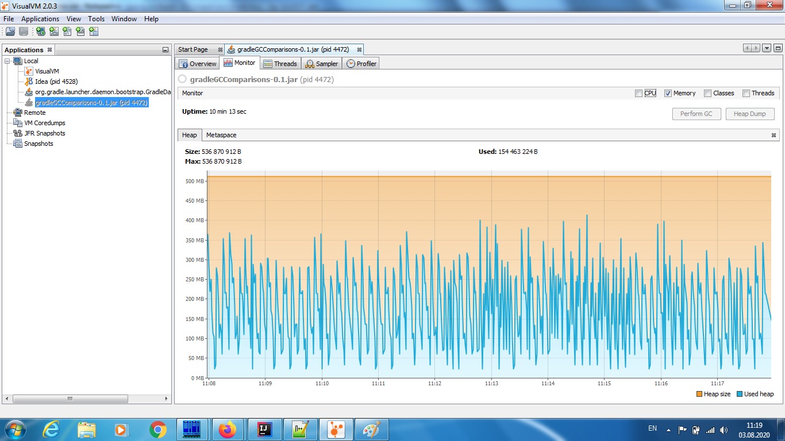
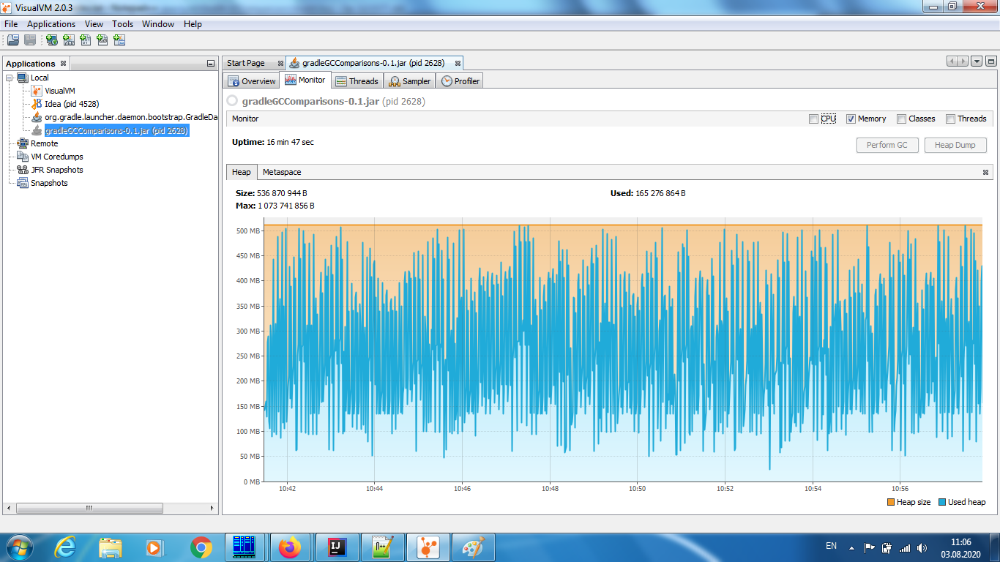
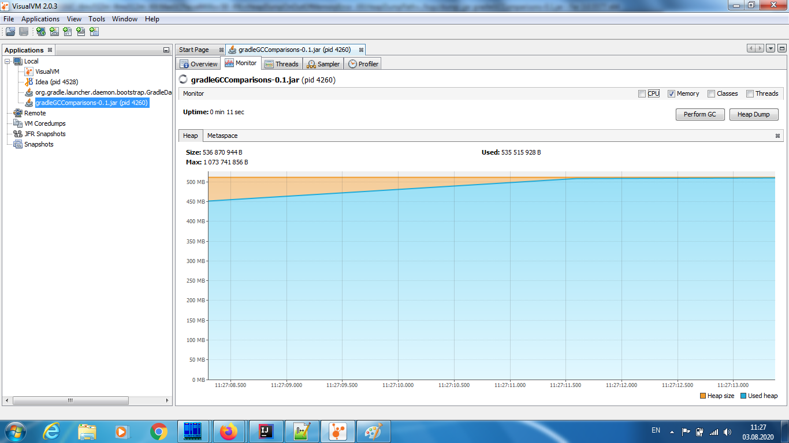
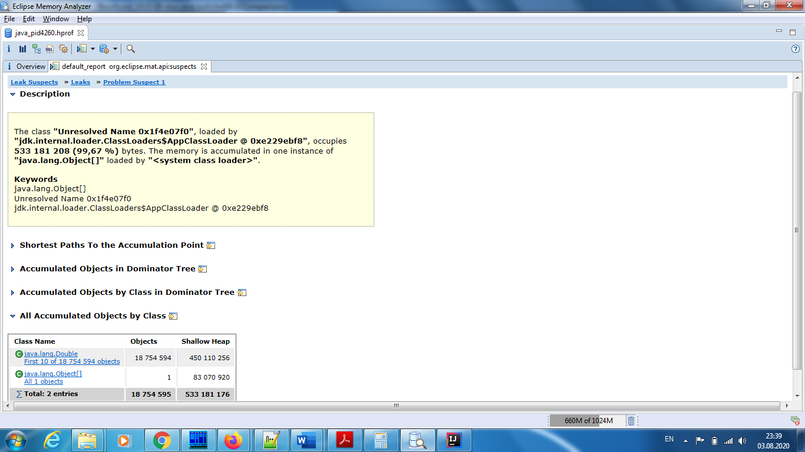

<?xml version="1.0" encoding="UTF-8"?>
<module type="JAVA_MODULE" version="4" />

# Домашнее задание: Сравнение разных сборщиков мусора

### Курс "Разработчик Java" в OTUS

### Студент
ФИО слушателя: Люлин Вадим Евгеньевич
Название курса: Разработчик Java
Группа: 2020-06

## Критерий сравнения: 
Пропускная способность — отношение общего времени работы программы к общему времени простоя, вызванного сборкой мусора, на длительном промежутке времени. 

## Параметры запуска
### Serial GC
java -XX:+UseSerialGC -Xms512m -Xmx512m -XX:MaxGCPauseMillis=50 -XX:+HeapDumpOnOutOfMemoryError -XX:HeapDumpPath=./logs/dump -jar gradleGCComparisons-0.1.jar
### G1 GC
java -XX:+UseG1GC -Xms512m -Xmx512m -XX:MaxGCPauseMillis=50 -XX:+HeapDumpOnOutOfMemoryError -XX:HeapDumpPath=./logs/dump -jar gradleGCComparisons-0.1.jar

## Данные полученные в результате тестирования
Параметр | Serial GC | G1 GC
--- | --- | ---
Общее время работы приложения, сек | 613,000 | 1006,000
SerialGC: Copy / G1GC: G1 Young Generation, сек. | 201,848 | 458,842
SerialGC: Copy / G1GC: G1 Young Generation, в % к общему времени работы | 32,93% | 45,61%
SerialGC: MarkSweepCompact / G1GC: G1 Old Generation, сек. | 138,788 | 73,232
SerialGC: MarkSweepCompact / G1GC: G1 Old Generation, в % к общему времени работы | 22,64% | 7,27%
Общее время затраченное GC | 340,636 | 532,074
Общее время | 55,57% | 52,89%

## Serial GC heap

## G1 GC heap

## Выводы
В моём случае замена сборщика мусора Serial на G1 не оправдала себя увеличив время работы приложения почти вдвое.
В обоих случаях, при использовании либо Serial GC, либо G1 GC, примерно половина времени работы приложения ушло на работу GC.
Данный факт явился для меня очень удивительным. Половину времени тратить на сборку муссора, выглядит очень расточительно.
Допускаю, что, возможно, либо что-то сделал неправильно, либо ошибка в расчетах. 

## Задание: Добиться OutOfMemory в этом приложении через медленное подтекание по памяти
Утечка пямяти организована на основе статьи https://topjava.ru/blog/java-memory-leaks
раздела 3.1 Утечки памяти из-за статических полей

Для получения OutOfMemory требуется: 
1) в классе MemorableClass разкомментировать строку  
//    public static List<Double> list = new ArrayList<>();  
и закоментировать  
public List<Double> list = new ArrayList<>();
2) в классе GCStatisticsCollector разкомментировать строку  
//        int size = 5 * 10000; // Количество создаваемых элементов в List  
и закомментировать  
int size = 5 * 1000 * 1000; // Количество создаваемых элементов в List  

## G1 GC heap

Dump был проанализирован с помощью интрумета Memory Analyser (https://www.eclipse.org/mat/downloads.php)

### Причина OutOfMemory показанная в отчете Leak Suspects
The class "Unresolved Name 0x1f4e07f0", loaded by "jdk.internal.loader.ClassLoaders$AppClassLoader @ 0xe229ebf8", occupies 533 181 208 (99,67 %) bytes. The memory is accumulated in one instance of "java.lang.Object[]" loaded by "<system class loader>".

Keywords
java.lang.Object[]
Unresolved Name 0x1f4e07f0
jdk.internal.loader.ClassLoaders$AppClassLoader @ 0xe229ebf8

Примечание: еще бы научиться определять класс "Unresolved Name 0x1f4e07f0"

### All Accumulated Objects by Class

Class Name | Objects | Shallow Heap
--- | --- | ---
java.lang.Double First 10 of 18 754 594 objects | 18 754 594 | 450 110 256 
java.lang.Object[] All 1 objects | 1 | 83 070 920 
Total: 2 entries | 18 754 595 | 533 181 176 

